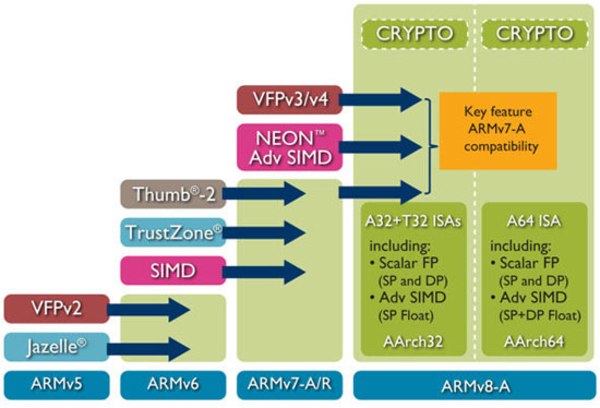
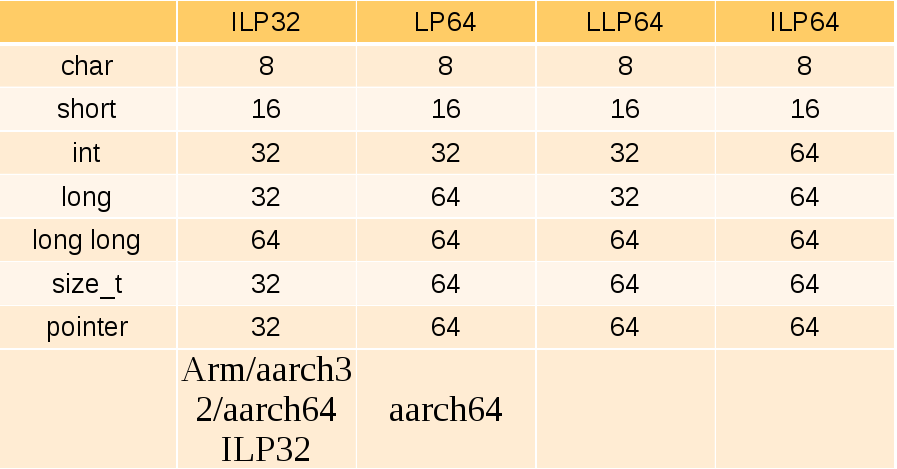
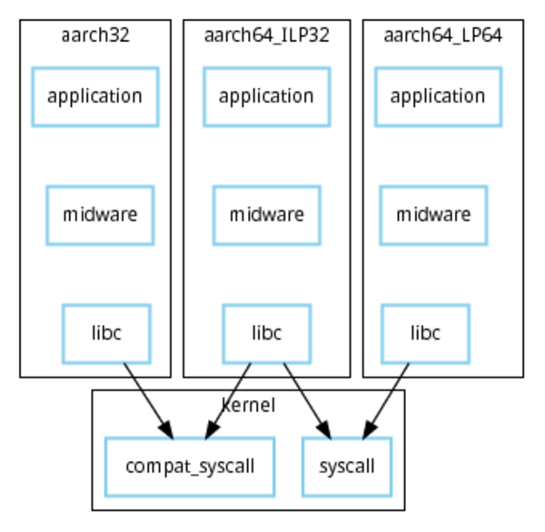
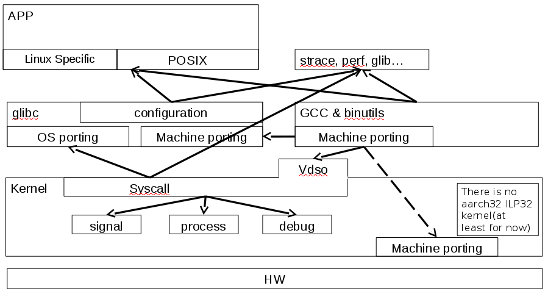
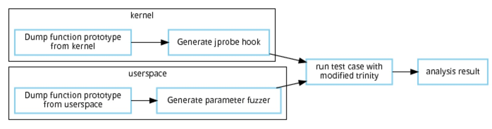

---
author:
- Bamvor Jian Zhang <bamvor.zhangjian2huawei.com>
title: An efficiency unit test and fuzz tools for kernel/libc porting
titlepage-note: |
  For Linuxcon Europe
institute: Huawei Technologies
...

## Self introduction

*   Kernel developer from Huawei
*   Linaro kernel working group assignee
*   Focus on migration 32bit application from arm 32bit hardware to 64bit hardware.
*   Interested in in memory management.

# aarch64 ILP32 overview.
\note{ ILP32 is one of three abis existing on arm64. Which provide a software migration path from arm 32bit hardware to 64bit hardware}

# What is ILP32?
## ILP32 abi

## data model

## migrate 32bit application to 64bit hardware

## ILP32 enablement

## Why we need unit test for ILP32?
There are actually lots of choices for a new api.

*   The definition of basic type, such as time_t, off_t and so on.
*   Argument passing.
*   delouse.

## Lots of abi changes.
During developemnt of ILP32, there are three big change in ILP32 which lead to lots of duplicate work.

## Version A
*   Most of syscall is as same as 64bit syscall.
*   time_t and off_t is 64bit. In POSIX, time_t should be 32bit for 32bit application.
Notes: Glibc community think that time_t must be 32bit.

## Version B
*   Most of syscall is compat syscall.
*   time_t and off_t is 32bit
*   Pass 64bit variable through one 64bit register.
*   Do the sign extend when enter into kernel.
Notes: It is hard to maintain the code of glibc because of the arguments passing and delouse.

## Version C
*   Most of syscall is compat syscall.
*   time_t is 32bit and off_t is 64bit
*   Pass 64bit variable through two 32bit register.
*   Clear the top-havies of register when enter kernel.
Notes: Current version. Glibc community is re-organzie the code for a generic new api.

# How many issues found by trinity when LTP syscall fails is < 20?

# 0

## Compare the exist kernel/glibc test tools.
*   Whether easy to reproduce the failure.
*   Whether support coverage
*   Whether support libc test.

# LTP

# glibc testsuite

# Trinity
Notes: Trinity is developed in a long time. It could randomize the parameter of syscall and run individual syscall standalone or parallel. When I do the long time parallel test(not for ILP32), it could report some bug, e.g. hang, panic. It is useful but it is indeed hard to debug because it usually fail after a long time running. I do not know what does it exactly do.

# Syzkaller
Notes Compare with Trinity, syzkaller is quite different. Here is the comparision between syzkaller and our tools:
Notes: 1.  Syzkaller could recursively randomize base date type in syscall which means it is possible generate more meaningfull syscall test. But it only test the syscall through syscall() function. It assume that the c library is correct and stable. But it is wrong if we are porting new abi(such as ILP32) or architecture to glibc and kernel. We need to take c library into account. This is what my tools could do.
Notes:
Notes: 2.  Syzkaller could generate the readable short testcases. Our tools could only test individual syscall and check the correctness of parameter and return value. I think it is enough for the unit test which tests syscall one by one.
Notes:
Notes: 3.  Syzkaller could do the coverage. Our tools could not. I think it is useful for me. I plan to add the coverage later.
Notes: The main function in syz-fuzzer/fuzzer.go will check whether kcov is enabled when noCover flag is not set.  Function triageInput is only used when noCover is not set. It will generate the score of coverage difference.  It seems that syz-fuzzer/fuzzer.go call BuildChoiceTable to generate the syscall list which is the input for syz-executor.

# AFL and triforce

# What's missing?
*   There is no test for libc part.
*   There is no full unit test for syscall.

\note{ *   There is no test for libc part.  The developer who do the port is care about both kernel and libc.
       *   There is no full unit test for syscall. These tools assume that the parameter passing is correct from userspace/libc to kernel. It may lead to strage issue for test which is not easy to debug.
}

# Introduce syscall unit test

## The test flow of syscall unit test

\note{
 Dump the function                                 Dump the function
 prototype from                                    prototype from c
 vmlinux from the                                  library from the
 sys_call_table                                    given list(posix
 array in kernel.                                  interfaces or user
        |                                          defined).
        |                                                 |
        |                                                 |
       \|/                                               \|/
        `                                                 `
 Generate jprobe        Modity Trinity to          Generate struct
 hook according to      support run syscall        fuzz generator
 prototype which        syscall from c             from the prototype.
 will recursively       libray instead             And add them of
 print the syscall      syscall() function         to trinity. Trinity
 value.                       |                    will recursively
        \                     |                    print the function
         \                    |                    parameter.
          \                   |                           /
           -----------------------------------------------
                              |
                             \|/
                              `
               Run the trinity each syscall once
               and compare the function parameter
               printed in kernel and userspace
               If inconsistent, print specific
               information, such endian issue,
               32<->64bit conversion issue and
               so on.
}

## What is the future of syscall unit test?
Contribution to LTP? or keep it as a standalone test case?

## TODO list
Support all the syscalls other than libc.

# QA

